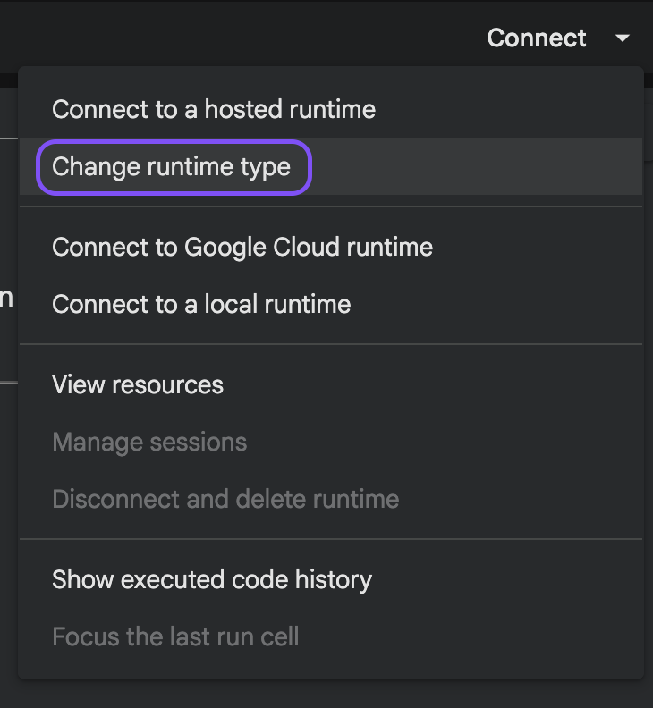
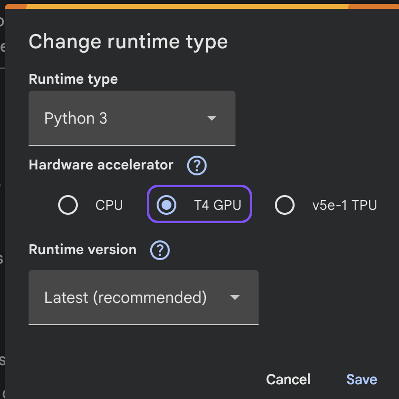
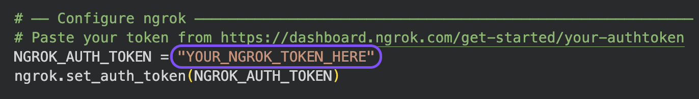
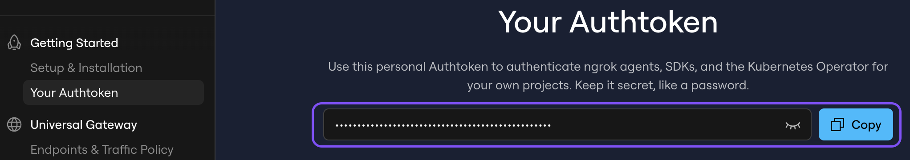

<p align="center">
  
</p>

# <p align="center">AmicoScript</p>

<p align="center"><strong>AmicoScript local audio transcription tool.</strong></p>

<p align="center">
  
  
  
  
  
</p>

<p align="center">
  🌐 <strong><a href="https://sim186.github.io/AmicoScript/">Website</a></strong> · ⭐ <strong><a href="https://github.com/sim186/AmicoScript">Star if useful</a></strong> · 💬 <strong><a href="https://t.me/amicoscript">Telegram @amicoscript</a></strong> · 📊 <strong><a href="BENCHMARKS.md">Benchmarks</a></strong> · 🐛 <strong><a href="https://github.com/sim186/AmicoScript/issues">Issues welcome</a></strong>
</p>

**AmicoScript** is a privacy-focused, local-first transcription tool built on OpenAI's Whisper models. It allows you to transform audio recordings into structured, searchable transcripts without your data ever leaving your repository or machine. Whether you need speaker identification (diarization), translation, or simple subtitles, AmicoScript provides a fast, free, and secure alternative to cloud services.


AmicoScript is perfect for journalists, researchers, students, or anyone who wants control over their audio data and transcripts. It supports batch processing, multiple export formats, and optional AI analysis features — all running locally on your hardware.

## ✨ Why AmicoScript

Most transcription tools:

- require uploading your audio to the cloud
- cost money or have limits
- don’t give you control over your data

AmicoScript keeps everything local.

→ Your audio never leaves your machine.

---

## 📊 How it compares

| Feature | AmicoScript | Buzz | WhisperX | Whisper WebUI | Insanely Fast Whisper |
|---------|:-----------:|:----:|:--------:|:-------------:|:--------------------:|
| Local-only (no cloud) | ✅ | ✅ | ✅ | ✅ | ✅ |
| Speaker diarization | ✅ | ✅ | ✅ | ✅ | ✅ |
| **Local LLM integration** (Ollama, LM Studio, Unsloth, …) | ✅ | ❌ | ❌ | ❌ | ❌ |
| URL import (7 platforms) | ✅ | YouTube only | ❌ | YouTube only | ❌ |
| Batch processing | ✅ | ✅ | ❌ | ✅ | ✅ |
| Desktop app (no Python needed) | ✅ | ✅ | ❌ | ❌ | ❌ |
| Docker support | ✅ | ❌ | ❌ | ✅ | ❌ |
| Web UI | ✅ | ❌ | ❌ | ✅ | ❌ |
| **Library backup / import** | ✅ | ❌ | ❌ | ❌ | ❌ |

*Comparison based on official READMEs as of April 2026. See something wrong? [Open a PR](https://github.com/sim186/AmicoScript/pulls).*

---

## 🚀 Features

- 🎧 Transcribe audio and video (MP3, WAV, M4A, OGG, FLAC, AAC, MP4, MOV, MKV)
- 🎙️ Record directly from your microphone (with pause support)
- 📞 Auto-record meetings (Windows, beta) — detects Teams/Zoom/Meet/WhatsApp calls and transcribes them automatically
- 🔗 Import directly from video URLs (YouTube, TikTok, Instagram, Facebook, X, Vimeo, Twitch)
- 📚 Batch process multiple files at once
- 🧠 Whisper models (tiny → large-v3)
- 🤖 AI analysis (summary, action items, translation, custom prompts) — long
  recordings are summarised in parts and merged, never silently truncated
- ✨ Optional automatic summary when a captured meeting ends
- 🧠 LLM integration: pick Ollama, LM Studio, Unsloth Studio, llama.cpp, vLLM,
  Jan or LocalAI from a list — or let AmicoScript find the one already running.
  OpenRouter and other hosted providers are supported too, behind an explicit opt-in
- 🗣️ Speaker diarization (who said what)
- 🌍 Real-time translation to English
- 🔍 Global search across transcripts
- 💬 Ask your library — a question answered from every transcript at once, with
  citations that open the recording at the second it was said. Works on keyword
  search out of the box; name an embedding model and it searches by meaning
- 🗂️ Organize with folders and tags
- ✨ Smart tagging — the LLM reads a transcript and proposes tags, reusing the
  ones your library already has. Nothing is applied until you click it
- 🏷️ Automatic platform tags for URL imports (for example: youtube, tiktok, instagram)
- 📦 Bulk operations: move to folder, assign/remove tags, export, delete selected recordings
- 🖱️ Multi-select with checkboxes, Ctrl+click (toggle), or Shift+click (range select)
- ✏️ Edit individual segments
- 📤 Export to JSON, SRT, WebVTT, TXT, Markdown, CSV — Markdown carries YAML
  frontmatter (date, duration, speakers, tags, folder, model), so a transcript
  dropped into Obsidian, Hugo or Jekyll arrives with its properties filled in
- 💾 Export/import your whole library as one file — backup, or move between machines
- 🔐 Password protection for network access (local use stays password-free)
- ⌨️ Keyboard shortcuts for fast navigation
- 🚀 For Mac, Windows, Docker, or local Python

---

## ⛔️ Disclaimer
AmicoScript is a personal project and not affiliated with OpenAI. It uses OpenAI's Whisper models, which are open-source, but AmicoScript itself is independently developed. Use at your own risk. I cannot guarantee the security, privacy, or performance of the application. Always review the code and understand how it works before running it on your machine.

## ⚡ Example

Upload a meeting recording → get a structured, time-stamped transcript you can search, edit, and export.

Paste a supported video URL in the drop area → AmicoScript fetches the audio and starts transcription automatically.

---

## 🖥️ Quick Start

### Docker (recommended)

```bash
docker compose up --build
```

Then open: http://localhost:8002

The default image is CPU-only. On a machine with an NVIDIA GPU and the
[Container Toolkit](https://docs.nvidia.com/datacenter/cloud-native/container-toolkit/latest/install-guide.html)
installed, build the CUDA image instead:

```bash
docker compose -f docker-compose.yml -f docker-compose.gpu.yml up -d --build
```

Either way the app picks its device itself, and every job logs which one it
got — so if the GPU is not being used, the job log says so rather than just
running slowly.

#### Production deployment with HTTPS (Traefik)

If you're running behind a [Traefik](https://traefik.io/) reverse proxy, use the production override:

```bash
cp .env.example .env
# Edit .env and fill in APP_DOMAIN, TRAEFIK_NETWORK, TRAEFIK_CERTRESOLVER
docker compose -f docker-compose.yml -f docker-compose.prod.yml up -d
```

`docker-compose.prod.yml` adds Traefik labels and joins the Traefik Docker network. Traefik handles TLS termination and automatic Let's Encrypt certificates.

> 🔐 **Set a password before exposing AmicoScript.** Requests from anywhere other
> than the machine it runs on are refused until one exists — the app fails closed
> rather than publishing your transcripts. Set `AMICOSCRIPT_PASSWORD` in `.env`,
> or open the app on the host and use **Security → Set password**. Local use is
> unaffected: on a laptop AmicoScript never asks for anything.
>
> If something else already guards the app (an SSO proxy, Traefik basic-auth),
> set `AMICOSCRIPT_AUTH=off`. See [docs/doc.md](docs/doc.md#authentication).

---

### Local

```bash
pip install -r backend/requirements.txt
python run.py
```

`run.py` opens a native desktop window when `pywebview` is installed, and falls
back to a system browser tab when it is not. Override with `AMICOSCRIPT_UI`:

| Value | Behaviour |
|-------|-----------|
| `window` (default) | Native window — WKWebView on macOS, WebView2 on Windows |
| `browser` | Serve only, open the default browser |
| `none` | Serve only, open nothing (same as `AMICOSCRIPT_NO_BROWSER=1`) |

On Linux the native window needs system WebKitGTK (`gir1.2-webkit2-4.1` +
`python3-gi`); without it the app degrades to a browser tab. See
[docs/desktop-shell.md](docs/desktop-shell.md).

### Terminal (TUI)

Prefer the keyboard? AmicoScript also ships a terminal interface — same
backend, no browser needed.

```bash
./tui.sh      # macOS/Linux — installs TUI deps on first run, then launches
tui.bat       # Windows
```

See [tui/README.md](tui/README.md) for keybindings and screenshots. The web
UI's Help modal also has a one-click "Copy command" for this.

### Tests

```bash
pytest -q
```

## 🏃🏼 Running from the installer
In the [releases](https://github.com/sim186/AmicoScript/releases) page you can download the application for Windows or Mac (Linux is coming). Be careful that the .exe (or. the dmg) might be recognized as suspicious by the OS.

### macOS: Running unsigned apps (Not disabling Gatekeeper)

1. Download the latest release from the Releases page.
2. Because the app is not signed by Apple, macOS will initially block it. Open System Settings → Privacy & Security and enable "App Store and identified developers" (allow apps downloaded from App Store and identified developers).
3. Unzip the downloaded file. Double-click the application file (`AmicoScript.app`). macOS will prevent it from opening because it's from an unidentified developer.
4. In System Settings → Privacy & Security, click the "Open Anyway" button next to the blocked app, then confirm when prompted to allow the application to run.
5. The app will launch normally after confirmation.

`run.py` will download `ffmpeg` automatically on first run.

---

## 🧪 Performance

Performance depends on your hardware (CPU/GPU) and selected model size.

- Larger models → better accuracy
- Smaller models → faster processing

**Run the built-in benchmark** from the transcribe sidebar to measure inference speed on your machine (RTF across tiny/small/medium models). Results can be shared to the community — see [BENCHMARKS.md](BENCHMARKS.md) for real-world numbers from different hardware.

If performance on your machine is not acceptable and you are fine with releasing a bit of local-first philosophy, take a look at the Google Colab section.

---

## ☁️ Optional: Cloud Power (Google Colab)

If you don't have a powerful local GPU, you can offload the heavy transcription workload to Google Colab for free while keeping the application and your file library strictly local. This option is absolutely optional.

1. Toggle **Cloud Power** on in the sidebar.
2. Click **Open notebook in Colab ↗** — this opens the notebook directly in Google Colab without any manual upload.
3. In Colab, go to **Runtime > Change runtime type** and select **T4 GPU**.





4. Run **Cell 1** to install dependencies (~2–4 min).
5. Get your free [ngrok authtoken](https://dashboard.ngrok.com/get-started/your-authtoken), paste it into `NGROK_AUTH_TOKEN` in **Cell 2**, then run it.





6. Copy the generated `.ngrok-free.app` URL and paste it into the **Colab Bridge URL** field in AmicoScript.

> The ngrok URL changes every session — re-paste it each time you restart the notebook.

Your files will now be seamlessly processed on the cloud GPU, but saved and managed exclusively on your local machine!

---

## 📞 Optional: Automatic Meeting Recording (Windows, beta)

AmicoScript can notice when you are in a call, record it, and hand the audio to
the normal transcription queue when the call ends — so a meeting turns into a
searchable transcript without you touching anything.

Detection is entirely local: it inspects which processes hold active Windows
audio sessions. No meeting APIs, no calendar access, nothing leaves your machine.
It recognises dedicated meeting apps (Teams, Zoom, Webex, GoToMeeting, Whereby,
RingCentral) whenever they play audio, and catches browser meetings such as
Google Meet plus chat-app calls (WhatsApp, Telegram, Signal, Slack, Discord) by
spotting any app using your microphone and speakers at the same time.

**Turning it on:** open the sidebar → **Meeting auto-capture** → *Auto-record
meetings*. Nothing is ever recorded until you flip that switch.

- **Windows app:** the helper is built in. Just use the toggle.
- **Docker / running from source:** the app cannot reach your host's audio, so a
  small background helper is installed separately. A banner offers a one-click
  `setup.bat`, or run `scripts\meeting_watcher\setup.bat` yourself. No admin
  rights needed. See [scripts/meeting_watcher/README.md](scripts/meeting_watcher/README.md).

While a meeting is being captured you get a red **Recording** chip with a live
timer in the app, a coloured tray icon (right-click to pause), and desktop
notifications when recording starts and stops. Recordings shorter than 15
seconds are discarded as false triggers. Meetings are transcribed with the same
model, language and diarization settings shown in your sidebar.

> ⚠️ **Recording a conversation may require the consent of everyone involved and
> may be restricted by your employer's policy or local law. Make sure you are
> allowed to record before enabling this.**

macOS and Linux are not supported yet — the capture and detection layers are
Windows-specific.

---

## 🧩 Optional: Speaker Diarization

Uses `pyannote` and requires a Hugging Face token.

See full setup instructions in:
[Documentation](docs/doc.md)

## 🤖 AI Analysis & LLM

New in 1.4: AmicoScript can call a local LLM to produce analyses from transcripts — summaries, action-item extraction, full translations, or custom-prompt runs. Key notes:

**Setting it up:** open **LLM Settings** in the sidebar and either pick your tool
from the list — Ollama, LM Studio, Unsloth Studio, llama.cpp, vLLM, Jan, LocalAI,
OpenRouter, or anything OpenAI-compatible — or press **Find running servers** and
let AmicoScript scan for one. It fills in the address, tells you whether a key is
needed and what it looks like, and offers the models that server already has.

- Paste the address in whatever form your tool showed it. `http://localhost:1234`,
  `.../v1` and a full `.../v1/chat/completions` all work; AmicoScript normalises it
  and tells you what it changed.
- **Docker just works.** The compose file maps `host.docker.internal`, and
  addresses typed as `localhost` are rewritten to it automatically, with a note
  explaining why. Your LLM still has to listen beyond loopback
  (`OLLAMA_HOST=0.0.0.0` for Ollama, "Serve on Local Network" for LM Studio).
- **Hosted providers are opt-in.** Audio never leaves your machine, but a hosted
  provider receives the transcript text. OpenRouter and any remote address are
  gated behind a confirmation, and analyses refuse to run until you give it.
- Test the connection from the UI or via `POST /api/llm/test-connection` — failures
  say which tool is not running, whether the key is wrong, or whether the address
  has a stray `/v1`.
- Per-recording analyses: `POST /api/recordings/{recording_id}/analyses`,
  `GET /api/recordings/{recording_id}/analyses`.

See [docs/doc.md](docs/doc.md#which-backends-work) for the full provider table.

---

## 📚 Documentation

Full documentation (API, setup, details):

[Documentation](docs/doc.md) · [Desktop shell (window, packaging, Tauri roadmap)](docs/desktop-shell.md)

---

## 🏗️ Architecture (brief)

- Backend: Python + FastAPI (`backend/main.py` + modular routers in `backend/api/routes/`)
- Frontend: plain ES modules in `frontend/js/`, loaded natively — still no build step
- Processing: downloads run concurrently, model inference stays serialized; interrupted jobs are requeued on restart
- Storage: local SQLite metadata (versioned migrations) + managed recording files, exportable as a single bundle

---

## 🗺️ Roadmap

See [docs/ROADMAP.md](docs/ROADMAP.md) for full priority breakdown.

**Currently planned:**
- Speaker library — recognise recurring voices across recordings
- Chat with your library (semantic search + Q&A over all transcripts)
- AI-powered smart tagging

---

## 🤝 Contributing

Feedback, issues, and contributions are welcome. See [CONTRIBUTING.md](CONTRIBUTING.md) for how to get started.

---

## ⭐ Star & Share

If AmicoScript saves you time, a star helps others discover it.

💬 Join the community on **[Telegram @amicoscript](https://t.me/amicoscript)** — share feedback, request features, show what you built.

---

## ⚖️ License

This project is licensed under the **MIT License**. See the [LICENSE](LICENSE) file for more details.
